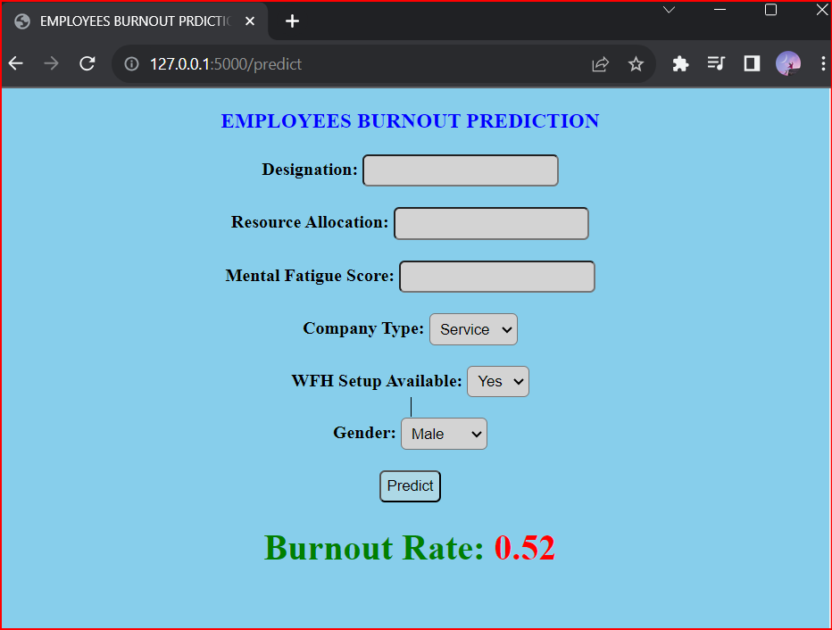

<!DOCTYPE html>
<html lang="en">

<head>
    <meta charset="UTF-8">
    <meta http-equiv="X-UA-Compatible" content="IE=edge">
    <meta name="viewport" content="width=device-width, initial-scale=1.0">
    <title>Employees Burnout Analysis and Prediction</title>
</head>

<body>

    <h1 align="center">Employees Burnout Analysis and Prediction</h1>
    

    

        
        
        
        
        
        
        
    

    <h2>Description</h2>
    
This project aims to develop a predictive model using machine learning techniques to predict the burnout rate of an
        employee based on various factors. By understanding the factors contributing to burnout and developing prediction
        models, we aim to identify at-risk employees and provide targeted support.

    

        <a href="https://employeesburnoutprediction.pythonanywhere.com/" style="color:#FF5733;">🚀 View Demo</a>
    

    <h2>Dataset</h2>
    
Download the dataset for custom training <a href="data/">here</a>.

    
This dataset contains employee information, including the number of designations, work-from-home availability, and
        other relevant attributes.

    <h2>Project Structure</h2>
    
The project is organized into the following directories and files:

    <ul>
        <li><a href="data/">Data</a>: The data folder contains both raw and processed data used in this project.</li>
        <li><a href="notebooks/">Notebooks</a>: This folder contains Jupyter notebooks with code covering data exploration,
            model building, and evaluation.</li>
        <li><a href="models/">Models</a>: This folder houses a collection of trained machine learning models.</li>
        <li><a href="reports/">Reports</a>: This folder contains project reports, such as a Power BI data analysis report
            and a presentation.</li>
        <li><a href="images/">Images</a>: This folder contains all the relevant images used in this project.</li>
        <li><a href="static/">Static</a>: This folder includes static files used in the project, such as images,
            stylesheets.</li>
        <li><a href="templates/">Templates</a>: The templates folder contains HTML templates used for rendering web pages.
        </li>
        <li><a href="app.py">app.py</a>: This is the main application file that runs the project's web application.</li>
        <li><a href="requirements.txt">Requirements</a>: This requirements text file contains all the required
            dependencies that we need to install to run the project.</li>
    </ul>

    <h2>How to Install and Run this Project?</h2>
    
To get started with the project, follow these steps:

    <ol>
        <li>Clone this repository to your local machine:</li>
        <code>git clone https://github.com/usmanbvp/Employees-Burnout-Analysis-and-Prediction.git</code>
        <li>Install the project dependencies by running the following command:</li>
        <code>pip install -r requirements.txt</code>
        <li>Explore the project's directories and files to become familiar with its structure.</li>
        <li>To run the project, execute the following command:</li>
        <code>python app.py</code>
    </ol>

    <h2>How to Use this Project?</h2>
    
Once you have successfully installed and run the project, you can use it to predict the burnout rate of employees.
        Here's how to get started:

    <ol>
        <li>Open your web browser and navigate to <code>http://127.0.0.1:5000/</code></li>
        <li>You will be presented with a user-friendly web app interface. Explore the available features and prediction
            options.</li>
        

            
        

        <li>Follow the on-screen instructions to input relevant employee data. Utilize the prediction feature to predict
            future burnout outcomes for employees.</li>
        <li>The web app should provide you with results based on your input.</li>
        

            
        

        <li>Based on the results, you can take any necessary actions, make decisions, or utilize the project for your
            specific use case.</li>
    </ol>

    <h2>Deployment</h2>
    
To deploy this project, follow these steps:

    <ol>
        <li>Choose a hosting platform or service for your web application. Popular choices include Heroku, AWS, Azure, or
            PythonAnywhere.</li>
        <li>Set up an account on the selected hosting platform if you don't already have one.</li>
        <li>Prepare your project for deployment by making sure it meets the requirements of the chosen hosting service.
            This may include adjusting configuration files, environment variables, or dependencies.</li>
        <li>Deploy your project to the hosting platform using the platform's provided deployment tools or instructions.</li>
        <li>Once deployed, you can access your project by navigating to the URL provided by the hosting platform.</li>
    </ol>

    
For more detailed deployment instructions specific to your chosen hosting service, refer to their official
        documentation and guidelines.

    

        <a href="https://employeesburnoutprediction.pythonanywhere.com/" style="color:#FF5733;">🚀 View Deployed Web
            App</a>
    

    <h2>License</h2>
    
This project is licensed under the MIT License - see the <a href="LICENSE">LICENSE</a> file for details.

    
The MIT License is a permissive open source license that allows you to use, modify, and distribute this project
        for both commercial and non-commercial purposes.

    <h2>Feedback and Support</h2>
    
If you have any feedback, suggestions, or questions regarding the project, please create an issue in the repository
        or contact me at <a href="mailto:usman.bvp@gmail.com">usman.bvp@gmail.com</a>.

    
If you find this repository helpful, don't forget to show your support by giving it a star! ⭐ Your star is a great
        way to let us know you appreciate our work and find value in this project. Thank you! ⭐

    
Happy analyzing and predicting ❤️!

</body>

</html>
